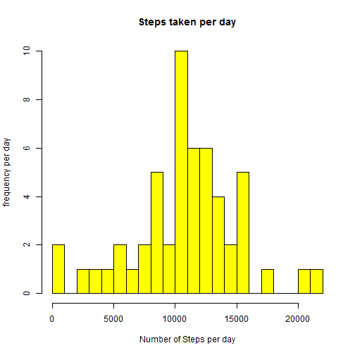
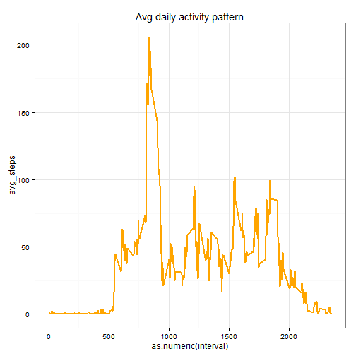
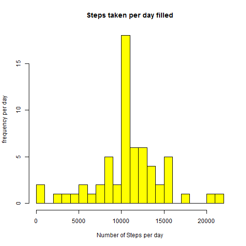
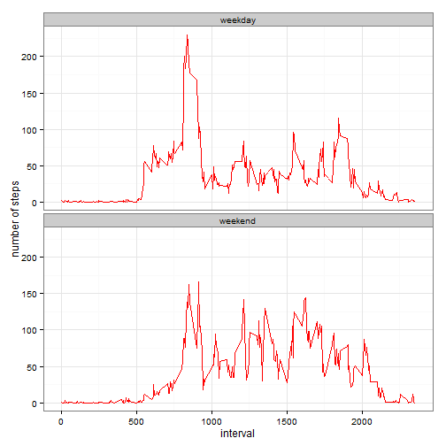

```r
library(data.table)
```

```
## data.table 1.9.4  For help type: ?data.table
## *** NB: by=.EACHI is now explicit. See README to restore previous behaviour.
```

First we will unzip and load the into a dataframe. And examine it


```r
Atbl<-read.csv(unzip("activity.zip"),colClasses = c("numeric","Date","numeric"))
Atbl$date<-as.Date(Atbl$date,format = "%Y-%m-%d")
#Atbl$interval<-as.factor(Atbl$interval)
str(Atbl)
```

```
## 'data.frame':	17568 obs. of  3 variables:
##  $ steps   : num  NA NA NA NA NA NA NA NA NA NA ...
##  $ date    : Date, format: "2012-10-01" "2012-10-01" ...
##  $ interval: num  0 5 10 15 20 25 30 35 40 45 ...
```

```r
head(Atbl,3)
```

```
##   steps       date interval
## 1    NA 2012-10-01        0
## 2    NA 2012-10-01        5
## 3    NA 2012-10-01       10
```

```r
tail(Atbl,3)
```

```
##       steps       date interval
## 17566    NA 2012-11-30     2345
## 17567    NA 2012-11-30     2350
## 17568    NA 2012-11-30     2355
```

We now calculate the total number of steps taken,removing Na's


```r
total.steps<-sum(Atbl$steps,na.rm = TRUE)
total.steps
```

```
## [1] 570608
```

Calculate total steps per day.

```r
##x2<-aggregate(Atbl$steps,by=list((substr(Atbl$date,1,61))),sum, na.rm = T)
x2<-aggregate(steps~date,Atbl,sum)
names(x2)<-c("Date",'daily.steps' )
head(x2)
```

```
##         Date daily.steps
## 1 2012-10-02         126
## 2 2012-10-03       11352
## 3 2012-10-04       12116
## 4 2012-10-05       13294
## 5 2012-10-06       15420
## 6 2012-10-07       11015
```

```r
str(x2)
```

```
## 'data.frame':	53 obs. of  2 variables:
##  $ Date       : Date, format: "2012-10-02" "2012-10-03" ...
##  $ daily.steps: num  126 11352 12116 13294 15420 ...
```
plot a histogram  of steps by each day


```r
hist(x2$daily.steps,col = "yellow",breaks=25,main = "Steps taken per day",
   xlab = "Number of Steps per day",ylab = "frequency per day")  
```

 


Calculate the median and the mean for steps taken each day

```r
x3<-aggregate(Atbl$steps,by=list((substr(Atbl$date,1,61))),mean)
meansteps <-round(mean(x2$daily.steps,na.rm = T))

mediansteps <-median(x2$daily.steps,na.rm = T)
names(x3)<-c("Dates","mean.steps.")

x4<-aggregate(Atbl$steps,by=list((substr(Atbl$date,1,61))),median)
```
The Mean steps per day is

```
## [1] 10766
```
The Median steps per day is 

```
## [1] 10765
```

## Average daily avtivity pattern

```r
x3a<-aggregate(Atbl$steps,by = list(interval=Atbl$interval),mean,na.rm=T)
colnames(x3a)<-c("interval","avg_steps")
#plot(x3a,type="l")
#using ggplot2 to avoid side effects from above
library(ggplot2)
ggplot(x3a, aes(x=as.numeric(interval), y=avg_steps)) +  geom_line(color="orange",size =1)+labs(title="Avg daily activity pattern") +
   theme_bw()
```

 

find the interval with the most steps


```r
maxInterval<-x3a[which.max(x3a$avg_steps),]
```
The interval with the most steps is

```r
maxInterval$interval
```

```
## [1] 835
```

The count of steps for that interval is

```r
maxInterval$avg_steps
```

```
## [1] 206.1698
```
## Impute missing values

1. Caculate total missing values from original data set
 
 ```r
 missing_vals<-sum(is.na(Atbl$steps))
 ```
 
 Total number of missing values is 2304. 
 
##Filling missing values
we will use the mean value accross the days at the same interval


```r
Atbl_f<-Atbl
L <- dim(Atbl_f[1])
 for(i in 1:L) {
   if(is.na(Atbl_f$steps[i])){
     ival<-Atbl_f$interval[i]
     imp<-x3a[x3a$interval==ival,"avg_steps"]
     Atbl_f$steps[i]<-imp}}
```

```
## Warning in 1:L: numerical expression has 2 elements: only the first used
```

```r
  str(Atbl_f)
```

```
## 'data.frame':	17568 obs. of  3 variables:
##  $ steps   : num  1.717 0.3396 0.1321 0.1509 0.0755 ...
##  $ date    : Date, format: "2012-10-01" "2012-10-01" ...
##  $ interval: num  0 5 10 15 20 25 30 35 40 45 ...
```

Missing values in new data set

```r
sum(is.na(Atbl_f$steps))
```

```
## [1] 0
```
Zero output tells us there are no missing values

# Histogram of steps taken per day all values filled.

```r
Filled_Steps_Day  <-aggregate(steps~date,Atbl_f,sum)
names(Filled_Steps_Day)<-c("Date",'daily.steps' )

str(Filled_Steps_Day)
```

```
## 'data.frame':	61 obs. of  2 variables:
##  $ Date       : Date, format: "2012-10-01" "2012-10-02" ...
##  $ daily.steps: num  10766 126 11352 12116 13294 ...
```

```r
head(x2,2)
```

```
##         Date daily.steps
## 1 2012-10-02         126
## 2 2012-10-03       11352
```

```r
head(Filled_Steps_Day,2)
```

```
##         Date daily.steps
## 1 2012-10-01    10766.19
## 2 2012-10-02      126.00
```

```r
hist(Filled_Steps_Day$daily.steps,col = "yellow",breaks= 25,main = "Steps taken per day filled",
   xlab = "Number of Steps per day",ylab = "frequency per day")
```

 
Mean steps per day filled

```r
NewMean<-mean(Filled_Steps_Day$daily.steps,na.rm = T)
NewMean
```

```
## [1] 10766.19
```
Median steps filled per day

```r
NewMedian <-median(Filled_Steps_Day$daily.steps,na.rm= T)
NewMedian
```

```
## [1] 10766.19
```
The Difference between the values of the mean and median are small

  *Before filling e missing values
  
   1. Mean: 1.0766 &times; 10<sup>4</sup>
   
   2. Median: 1.0765 &times; 10<sup>4</sup>
   
  *After filling missing values
  
   1. Mean: 

```r
NewMean
```

```
## [1] 10766.19
```
   
   2. Median: 

```r
NewMedian
```

```
## [1] 10766.19
```

#are there differences in activity patterns weekends vs. weekdays

we are using the data with filled in missing values


```r
weekdays_steps<-function(data){
 weekdays_steps<- aggregate(data$steps,by=list(interval=data$interval),
                FUN= mean,na.rm=T)
   

          colnames(weekdays_steps) <- c("interval","steps")
            weekdays_steps
}
 data_by_weekdays <- function(data) {
   data$weekday <-as.factor(weekdays(data$date))
   weekend_data<-subset(data,weekday %in% c("Saturday","Sunday"))
   weekday_data<-subset(data,!weekday %in% c("Saturday","Sunday"))
    
   weekend_steps <- weekdays_steps(weekend_data)
   weekday_steps <- weekdays_steps(weekday_data)
   
   weekend_steps$dayofweek <- rep("weekend",nrow(weekend_steps))
   weekday_steps$dayofweek <- rep("weekday",nrow(weekday_steps))
   
   data_by_weekdays<- rbind(weekend_steps,weekday_steps)
   data_by_weekdays$dayofweek <- as.factor(data_by_weekdays$dayofweek)
   data_by_weekdays
 }
 data_weekdays <- data_by_weekdays(Atbl_f)
```


```r
 ggplot(data_weekdays,aes(x=interval,y=steps))+
          geom_line(color="red") +
          facet_wrap(~dayofweek,nrow = 2,ncol = 1)+
          labs(x="interval",y="number of steps")+
          theme_bw()
```

 
        
